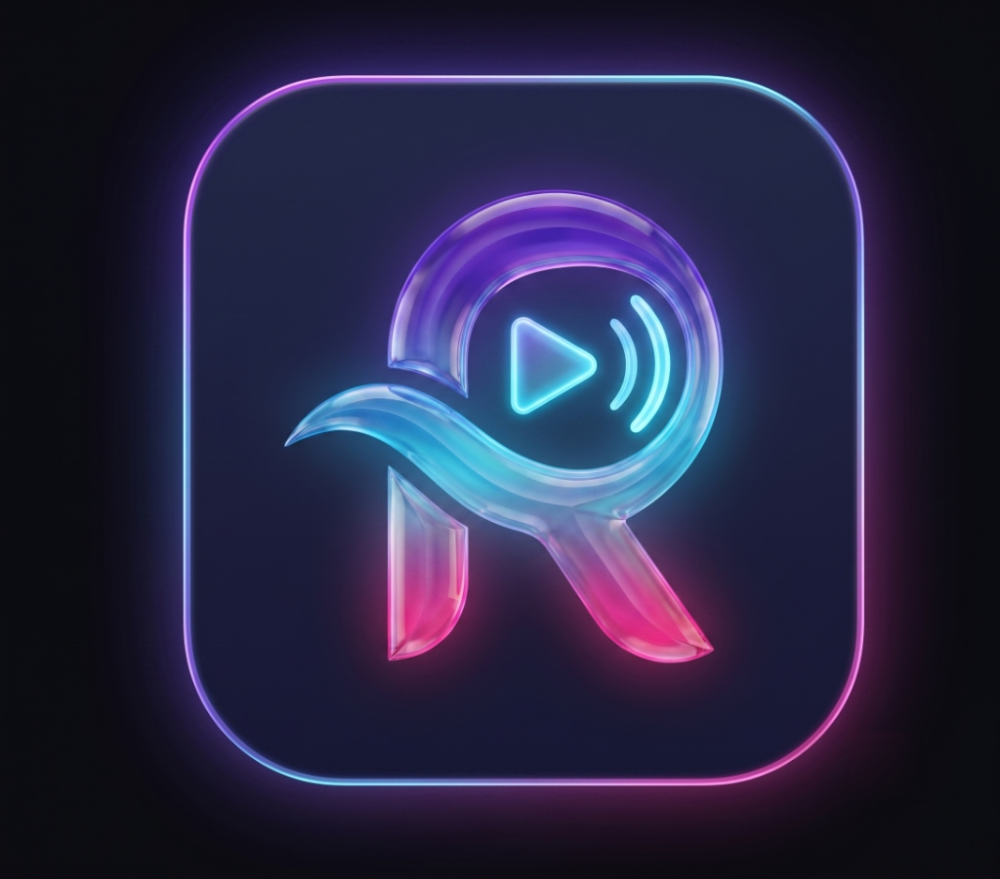
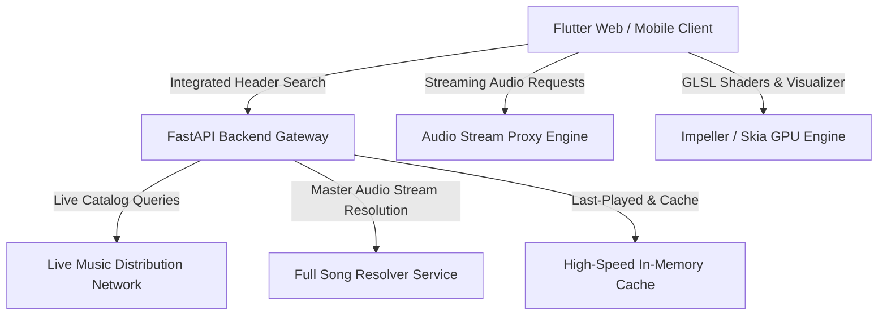

<div align="center">

  

  # Ruzelo (रुज़ेलो)

  ### *Next-Generation Cinematic Music Streaming Platform*

  [](https://flutter.dev)
  [](https://fastapi.tiangolo.com)
  [](https://python.org)
  [](https://riverpod.dev)
  [](LICENSE)

  <p align="center">
    <b>A cinematic, glassmorphic music streaming experience powered by real-time GLSL fragment shaders, 3D vinyl physics, intelligent audio energy reactivity, and 100% live real music streaming.</b>
  </p>

</div>

---

## ✨ Features & Capabilities

### 🎵 100% Real Live Music Streaming Network
- **Zero Mockups**: Direct streaming integration delivering real, high-fidelity music with official metadata, 600x600 HD artwork, and full-length master audio.
- **Fresh Releases**: Dynamically pulls the latest trending hits across Bollywood, Punjabi Pop, Desi Hip-Hop, and Global charts.
- **Full Song Engine**: Resolves and streams full-length master tracks (3–6 minutes) on demand with zero audio cutoff.

### 🔍 Integrated Header Search
- **Universal Top Bar Search**: Instant search input built directly into the header bar with live 300ms debouncing.
- **Real-Time Discovery**: Search millions of songs, artists, and albums with one-tap instant playback and smooth view switching.

### 🎧 Curated Genre Playlists
- **Curated Atmospheres**: Handcrafted genre-tailored playlists with dynamic live song rosters:
  - 🌹 *Bollywood Romance & Hits*
  - 🥁 *Punjabi Pop & Bhangra Drops*
  - 🎤 *Desi Hip-Hop & Street Rap*
  - 🌍 *Global Top 50 & Pop Anthems*
  - ⚡ *South Indian Blockbusters & Mass*
  - 🌙 *Late Night Lo-Fi & Indie Acoustic*
  - 🕊️ *Sufi Soul & Spiritual Trance*
  - 🪩 *EDM & Electro Dance Party*
  - 🔥 *Workout & High Energy Pump*

### ⏯️ Spotify-Grade Frosted Glass Mini-Player
- **Comprehensive Controls**: Previous track, Next track, Play/Pause with glowing gradient button, and Favorite heart action.
- **Interactive Scrubber**: Seek and scrub audio position directly from the mini-player's top progress line.
- **Drag-to-Expand**: Smooth upward swipe gesture to reveal the signature 3D player.

### 💽 Signature 3D Full-Screen Player
- **Interactive 3D Parallax Tilt**: Touch/mouse-driven physical tilt with real-time perspective distortion.
- **Rotating Vinyl Disc**: Smooth 360° record rotation synced to audio playback state.
- **Real-Time Audio Visualizer**: Live 60 FPS simulated waveform analyzer reacting to musical BPM and energy.
- **Particle Bursts**: Haptic touch particle explosions on track change and favorite interactions.

### 🎨 Liquid Glass & Atmospheric Mesh GLSL Shaders
- **Hardware-Accelerated GLSL**: Custom fragment shaders (`atmosphere_mesh.frag`, `atmosphere_glow.frag`, `liquid_glass.frag`) creating dynamic chromatic glass and ambient aurora lighting.
- **Dynamic Genre Palette Adaption**: Real-time smooth theme transitions based on track genre and artwork colors.

### 🔄 Last-Played Session Auto-Resume
- **Persistent State**: Automatically saves and restores your last-played song across reloads, highlighting a **"Jump Back In"** card on the Home feed.

---

## 🛠️ Architecture & Tech Stack



### Frontend (`ruzelo_frontend`)
- **Framework**: Flutter 3 (Web, macOS, Windows, Linux, Android, iOS)
- **State Management**: Riverpod 2.6 (`StateNotifierProvider`)
- **Audio Engine**: JustAudio + AudioService background handlers
- **Typography & Styling**: Google Fonts (*Plus Jakarta Sans*), Glassmorphism, Specular Border Painters
- **Shaders**: Custom GLSL fragment shaders compiled via Flutter Shader Pipeline

### Backend (`ruzelo_backend`)
- **Framework**: FastAPI (Async Python 3.11+)
- **Event Loop**: Windows Selector EventLoop Policy for Windows socket stability
- **Database**: Async SQLAlchemy with SQLite / PostgreSQL
- **Gateway**: Live Music Gateway with async HTTPX connection pooling and parallel gathering

---

## 📁 Repository Structure

```
ruzelo/
├── ruzelo_backend/                # FastAPI Backend Service
│   ├── app/
│   │   ├── api/v1/                # REST API Endpoints (tracks, streaming, playlists, auth)
│   │   ├── core/                  # Database, Config & Security Middleware
│   │   ├── models/                # SQLAlchemy ORM Models
│   │   ├── schemas/               # Pydantic Request/Response Schemas
│   │   └── services/              # LiveMusicGateway, FullSongService, CacheService
│   ├── main.py                    # Application Entrypoint
│   ├── run_server.py              # Dedicated Windows-Optimized Server Runner
│   └── requirements.txt           # Python Dependencies
│
├── ruzelo_frontend/               # Flutter Multi-Platform Client
│   ├── assets/
│   │   ├── images/app_logo.png    # High-Res Neon Glass Brand Logo
│   │   └── shaders/               # GLSL Fragment Shaders (.frag)
│   ├── lib/
│   │   ├── core/                  # Audio Handlers, Shaders, Glass Themes
│   │   ├── features/
│   │   │   ├── artist/            # Artist Profile & Discography
│   │   │   ├── atmosphere/        # Atmospheric Background Canvas
│   │   │   ├── home/              # Discovery Feed & Header Search
│   │   │   ├── library/           # Liked Songs & Curated Playlists
│   │   │   ├── player/            # Mini-Player & 3D Signature Player
│   │   │   ├── playlist/          # Playlist View & Track Lists
│   │   │   └── shell/             # Main Navigation Shell
│   │   └── main.dart              # App Bootstrap
│   └── test/                      # Unit & Widget Test Suite
└── README.md                      # Project Documentation
```

---

## 🚀 Quick Start Guide

### Prerequisites
- **Flutter SDK**: `>= 3.10.0` ([Install Flutter](https://docs.flutter.dev/get-started/install))
- **Python**: `>= 3.11` ([Download Python](https://www.python.org/downloads/))

---

### 1. Start the Backend Service

```bash
# Navigate to the backend directory
cd ruzelo_backend

# Create and activate virtual environment
python -m venv .venv

# On Windows (PowerShell):
.\.venv\Scripts\Activate.ps1
# On macOS/Linux:
source .venv/bin/activate

# Install dependencies
pip install -r requirements.txt

# Launch the backend server
python run_server.py
```
> The API server will be available at **`http://127.0.0.1:8000`** (Interactive Docs: **`http://127.0.0.1:8000/docs`**).

---

### 2. Start the Frontend Web App

```bash
# Open a new terminal and navigate to the frontend directory
cd ruzelo_frontend

# Install Flutter dependencies
flutter pub get

# Run on local web server
flutter run -d web-server --web-port 5050 --web-hostname 127.0.0.1
```
> Open your browser and navigate to **`http://127.0.0.1:5050`** to start listening!

---

## 🧪 Testing & Verification

### Run Flutter Unit & Widget Tests:
```bash
cd ruzelo_frontend
flutter test
```

### Run Backend Integration Tests:
```bash
cd ruzelo_backend
pytest
```

---

## 📄 License

This project is open-sourced under the **MIT License**. See the [LICENSE](LICENSE) file for details.

<div align="center">
  <sub>Crafted with ❤️ for music lovers everywhere.</sub>
</div>
